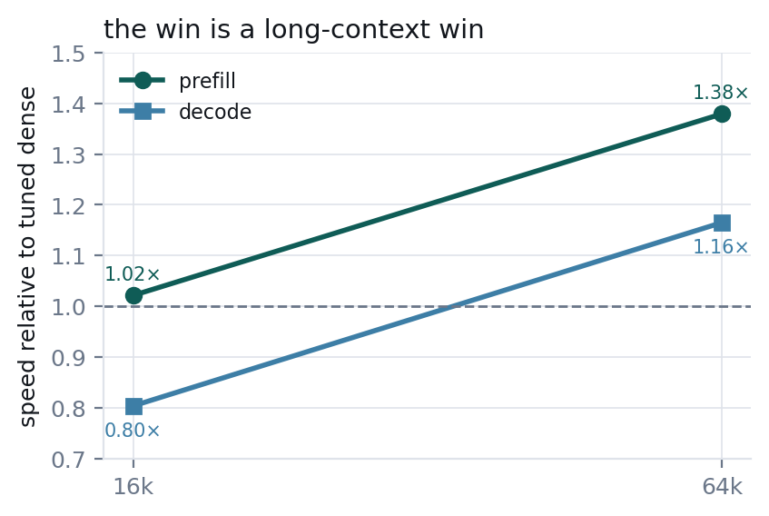
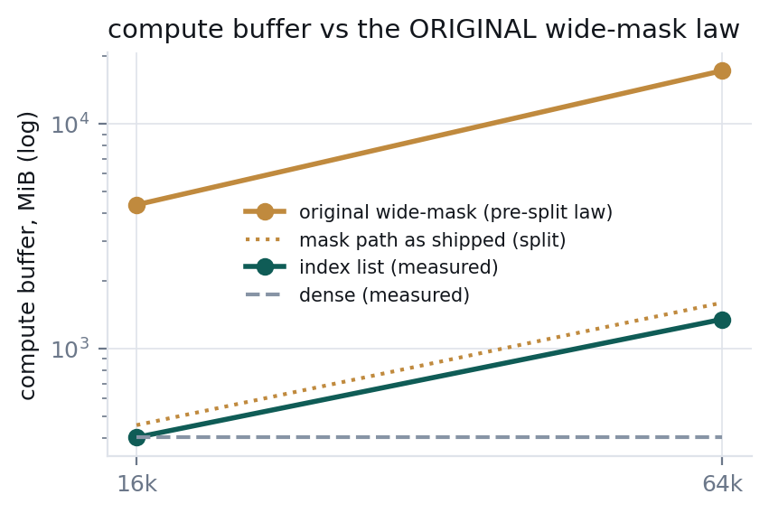
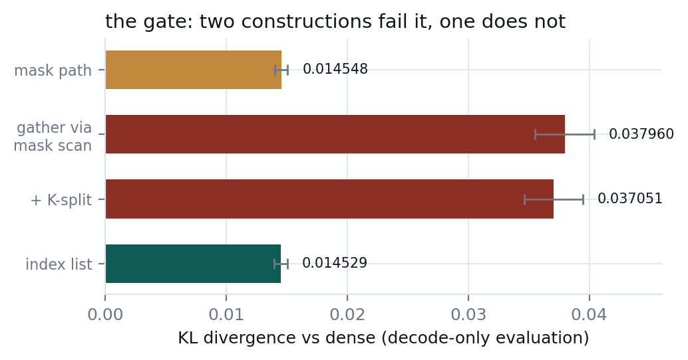

# MiniMax-M3 sparse attention: `--msa-gather`

MiniMax-M3's sparse attention (MSA) scores every cached token against four index heads, max-pools
those scores into blocks of 128, and attends only the top 16 blocks per index head. The answer to
"which cells does this query attend" is therefore **16 block ids per index head** — 64 ids, about
256 bytes in all.

This branch stops turning that answer into a mask. It also fixes a correctness bug that affects the
previous `minimax-msa` branch.

For context: `main` supports the architecture but not this mechanism. Its
`src/graphs/build_minimaxm3.cpp` is 69 lines with no indexer, no block selection and no top-k, and
there are no MSA options in `common/common.h`, so MiniMax-M3 runs dense there. Everything below is
about the sparse path, which is opt-in and off by default.

---

## Correctness fix: the local block was selected from a stale `kv_head`

**This affects the earlier `minimax-msa` branch (`891a963c`) and anyone running `--msa` from it.**

The reference force-includes the query's own block in the top-k selection
(`block_scores.scatter_(q_block, +inf)`). The block id comes from
`ggml_arange(ctx0, (float) kv_head, (float) (kv_head + n_tokens), 1.0f)`, and `ggml_arange` stores
`start`/`stop` in `op_params` when the **graph is built**. That is fine if the graph is rebuilt
whenever `kv_head` moves — but `can_reuse_graph()` keys on `kv_self.n`, not `kv_head`, flash
attention pads the cache to 256, and `update_cache_copies()` re-points the indexer-key write but
not this arange. `B_k` is 128, so inside one 256-step reuse window the true local block advances
twice while the baked one never moves: **the query's own block is force-included at the wrong index
for roughly half of all decoded tokens.** Graph reuse is on by default.

**Measured.** Same model, 16k prompt, greedy, `--temp 0`, fixed seed, 400 tokens, `-gr` against
`-no-gr`:

| arm | before the fix | after |
|---|---|---|
| `--msa --msa-gather` | **outputs diverge**, first difference near token 375 of 400 | identical |
| `--msa` (mask path) | identical in this sample | identical |
| dense | identical | not re-run (the fix cannot reach dense) |

Dense being clean rules out a general graph-reuse fault. The mask path carries the same stale
arange and should be assumed affected — one non-diverging sample is weak evidence, since the
divergence is a low-probability event that appears late in the generation. Two things make a test
of this useless: a short `-n`, and a small context. At `ctx 8192` with a short prompt roughly four
KV blocks are non-empty against a 16-block budget, so every block is selected regardless and the
force-include cannot matter.

**The fix** registers the arange at build time and re-points it in `update_cache_copies()`,
mirroring the `kr_l` cache-copy fixup a few lines above that exists for exactly this failure mode
on the indexer-key write:

```c
((float *) msa_local_arange->op_params)[0] = (float) kv_self.head;
((float *) msa_local_arange->op_params)[1] = (float) (kv_self.head + msa_local_arange->ne[0]);
```

Verified on a matched pair — the configuration that diverged is byte-identical after — and on a
second, independent prompt. Varying `--seed` does **not** vary this test: `--temp 0` is greedy, so
the seed is never read.

---

## What the code did before

Per sparse layer, per ubatch, the selection was expanded into an additive mask as wide as the whole
KV cache:

```
top-k block ids  ->  repeat to block size  ->  cont  ->  add causal floor
                 ->  permute  ->  pad  ->  cast to F16   =  {n_kv, n_tokens, idx_heads}
```

Then flash-attention consumed that mask and discarded ~97% of it.

Two costs follow. The mask is most of the compute buffer, and it grows with context: the measured law
was `0.262268 x n_kv + 70 MiB` at ubatch 512 — 4,367 MiB at 16k against dense's 403, and
**34,446 MiB at 128k**. And `ggml_flash_attn_ext` requires `mask->ne[1] >= GGML_PAD(n_tokens, 16)`, so at
decode a **single token's mask is padded to 16 rows and cast** — per sparse layer, to carry one real
row.

## What it does now

ik's flash-attention kernel already accepts a sparse cell list: put an I32 tensor on the node's
`src[5]` and `iqk_flash_attn_noalibi` gathers K, V and the mask itself, per query row
(`ggml/src/iqk/iqk_flash_attn.cpp:180`). GLM-DSA drives the same mechanism from
`build_deepseek2.cpp`. MSA could not use it before, because that path requires a single KV head and
MSA's mask carried four planes — the per-GQA-group split in the parent commit is what made the shape
legal.

So the only missing piece was the list itself:

```
sorted (I32 block ids, already computed)      first topk_blk rows = the selection
ggml_mask_to_index(all-zero mask)             -> [0, n_kv) as I32, reshaped {B_k, n_blocks}
ggml_get_rows_ext(table, ids, same_type)      -> the cell ids for the selected blocks
                                              -> attached to fa->src[5]
```

ggml has no integer arithmetic and `ggml_cast` cannot produce I32 (`ggml_compute_forward_dup` converts among
F32/F16/BF16 sources only), so the zero-mask trick is the one construction the tree supports today.

With the list in hand, **no sparse mask is built at all**. The kernel reads a mask only at the
selected positions, and the causal floor it needs is already in `KQ_mask`, which the graph builds once
and every sparse layer shares.

---

## Results

MiniMax-M3 Q4_K_M, CPU-only, dual Xeon Platinum 8260, `-t 48`, GPUs hidden with
`CUDA_VISIBLE_DEVICES=""` (`-ngl 0` alone does **not** stop batch-GEMM offload).
**All rows `-ub 512` for both arms.** Rows up to 16,576 use `-ntg 192`; the 65,600 row uses
`-ntg 64`, which does not affect prefill and changes the decode average by well under a percent.

Every number in the table is a single run. **Decode and prefill have very different noise, and the
difference matters more than the level.** Three interleaved repeats of each arm at n_kv 2,240,
same binary, same session:

| arm | prefill spread (sd) | decode spread (sd) |
|---|---:|---:|
| dense | **3.53%** | **0.24%** |
| gather | 1.26% | 0.80% |

So a decode difference above ~3% is real, and a prefill difference below ~7% is not. An earlier
version of this section quoted a single ±1.1% figure taken from prefill runs and applied it to
both; that was wrong in both directions. A run taken immediately after a change of regime came in
18% low; first-run-after-a-change is discarded.

| n_kv | dense decode | gather decode | dense prefill | gather prefill |
|---:|---:|---:|---:|---:|
| 2,240 | 4.15 | **2.77** | 80.33 | 81.26 |
| 4,288 | 4.04 | **2.75** | 74.06 | 69.19 |
| 8,384 | 3.91 | **2.74** | 63.88 | 59.47 |
| 16,576 | 3.30 | **2.60** | 49.34 | 50.45 |
| 65,600 | 1.98 | **2.13** | 16.08 | 27.08 |



Read the decode columns down. The gather falls **23%** across a 29x context range where dense falls
**52%**. That is the property, and a single ratio does not convey it. Both arms carry a cost that
grows with `n_kv` -- the gather still scores every cached token with the indexer -- but the
gather's grows about 2.4x more slowly, so the penalty it pays shrinks as context grows:

| n_kv | 2,240 | 4,288 | 8,384 | 16,576 | 65,600 |
|---|---:|---:|---:|---:|---:|
| gather decode minus dense decode, ms/token | +120 | +116 | +109 | +82 | **-36** |

Every cell above is **derived** from the two decode columns of the previous table --
`1000/gather - 1000/dense` -- and is in no log. The 2.4x is the ratio of the two arms' slopes over
the 8,384 -> 65,600 chord: 4.36e-3 against 1.83e-3 ms per kv token. Dense is not linear below 8k
(its 2,240 -> 8,384 slope is 2.41e-3), so that chord is the honest place to take a slope and the
crossover implied by it is an extrapolation, not a measurement.

The penalty is about 120 ms at the short end and is **not** fixed; describing it as a fixed cost
overstates the gather at low context and understates it at high. The crossover is where that
column changes sign, which is somewhere between 16k and 64k.

**Below that it is a net loss on decode, and the prefill differences below 64k are not
measurable.** Decode is **0.79x** at 16k, far outside the noise floor. Prefill is a different
story: three interleaved repeats of each arm at n_kv 2,240 give a dense prefill spread of
**3.53%** and a gather spread of 1.26%, so the standard deviation of a prefill *ratio* is about
3.7%. The table's prefill differences at 2k (+1.2%), 4k (-6.6%), 8k (-6.9%) and 16k (+2.3%) are
all inside about two of those, from one run per cell. **Only the 64k prefill result is outside the
scatter.** Do not read the 4k-8k prefill numbers as a finding.

(That scatter was measured where a prefill run lasts 27 s; at 16k it lasts 330 s and averages over
far more work, so it should scatter less. The figure above is an upper bound on the noise at
4k-16k, and the fix is repeats at those sizes, not an assumption either way.)

If your contexts live between 4k and 16k this branch has nothing to offer you on decode.

**Ubatch, and how the choice can flatter either arm.** Dense's own best prefill is `-ub 2048`
(19.42 at 64k, +20.8%), but that setting costs it decode (1.84 against 1.98 at `-ub 512`). So:

| gather `-ub 512` (27.08 / 2.13) vs | prefill | decode |
|---|---:|---:|
| dense at its best prefill (`-ub 2048`) | 1.39x | 1.16x |
| dense at its best decode (`-ub 512`) | **1.68x** | **1.08x** |

Quoting only the first row would understate prefill and overstate decode. Tuned for the metric you
care about, the decode win is about 8%. (`-ub 2048` moves the gather to 27.44 / 2.16 for a
5,359 MiB buffer — +1.3% prefill for 4x the memory, so 512 is the operating point.)

**Against the path it replaces.** Both MSA arms re-measured together on one binary
(`4856 b2fa29c0`), matched `-ub 512` and `-ntg 192`, GPUs hidden, gate PASS on both:

| 64k, `-ub 512`, `-ntg 192` | prefill t/s | decode t/s | compute buffer | graph nodes |
|---|---:|---:|---:|---:|
| `--msa` (mask path) | 11.21 | 1.58 | 1,625.13 MiB | 6,883 |
| `--msa --msa-gather` (cell list) | **26.21** | **2.28** | **1,333.26 MiB** | 6,429 |
| ratio | **2.34x** | **1.44x** | **0.82x** | 0.93x |

The mask path is *slower than dense at prefill*, because selecting blocks and then materialising a
mask costs more than the sparsity saves. That comparison, not the one with dense, is what this
change is for. (An earlier version of this paragraph quoted 2.36x / 1.34x from two runs on
different builds at `-ntg 64`; these replace them.)

### Compute buffer



1,333 MiB at 64k. The **original wide-mask** law (`0.262268 x n_kv + 70 MiB`) predicts 17,258 MiB
there, but that is not the arm this document benchmarks: the parent commit's per-GQA split had
already brought the shipped mask path to **1,625.13 MiB** (re-measured with the gather arm on one
binary; an earlier run of that arm gave 1,601.57). The like-for-like saving is therefore
**18% (1,625 -> 1,333), not 12.8x** — most of the growth was removed by the split, not by this
change.

At matched `-ub 512` dense's buffer is flat, 402.75 MiB at both 16k and 64k, while the gather's
goes 402.75 -> 1,350.49. So at equal context and ubatch **the gather uses 3.4x dense's buffer at
64k**. The term that scales is the indexer score tensor, `{n_kv, idx_heads, n_tokens}` F32, and the
floor-add output of the same shape: at `n_kv` ~65,600 and `-ub 512` each is
65,536 x 4 x 512 x 4 B = **512 MiB** (rounding n_kv down to the power of two; the padded value
adds under half a percent). Two of those on top of the 403 MiB floor accounts for the
measured 1,350 to within the slack the graph allocator has to reuse. That is arithmetic from the
shapes, not a measurement of the allocation plan, so treat it as the identification of the growing
term rather than a breakdown of the peak. A 128k point of 2,635 MiB exists but was not re-measured
in this configuration, so the chart stops at 64k.

---

## Quality

Sparse attention changes which cells are attended, so this needs a metric that survives an argmax
flip; greedy text does not.

**These KLD runs predate the graph-reuse fix above.** They were taken on 2026-08-16; the fix landed
on 2026-08-17. At `-ub 1` with `-fa` the cache still pads to 256, so graph reuse plausibly engages
inside `llama-perplexity` and both arms would carry the stale local block equally. The mask-vs-gather
comparison is therefore still sound — the defect is common to both — but the absolute figure against
dense may move. Not yet re-measured.



The measurement that matters is **decode-only**. `llama-perplexity` evaluates in batches, so its graph
is a prefill graph and it never exercises a decode gather at all. Forcing `-ub 1` makes every
evaluation a single-token decode graph:

| decode arm, ctx 8192, `-ub 1`, 1 chunk vs a dense reference | mean KLD | same top-1 |
|---|---:|---:|
| `--msa` (mask path) | 0.014548 ± 0.000546 | 96.020% |
| `--msa --msa-gather` | **0.014529 ± 0.000536** | **96.215%** |

0.02 sigma apart. For context, an earlier construction that derived the same list by scanning the
sparse mask for values exactly zero scored **0.037960 ± 0.002456** — nine sigma worse, and invisible
to both greedy text and ordinary batched perplexity.

**Read "vs a dense reference" as a divergence, not a quality loss.** Dense is the reference here
only because it is what this fork runs by default; MSA is the architecture's own mechanism, so
attending every cell is the path the model was not built for. The figure says how far the two
implementations sit apart. It does not say which is closer to the model's intended output, and
nothing here measures that.

---

## What this does not do

- **No help on hybrid GPU.** With 8 of 61 layers on four P100s, dense reaches 53.37 t/s prefill and
  every MSA arm lands between 30 and 34. MSA nearly doubles backend graph splits (1410 vs 774) and
  each split is a synchronisation. Use dense there.
- **It is a net loss below about 16k.** Prefill is ~7% slower at 4k-8k, and decode is 0.79x at 16k.
  The indexer scores every cached token on every decoded token, so the sparse path has its own
  O(n_kv) cost; it is smaller than dense's, which is why the two curves cross, but it is not zero
  and the penalty below the crossover is real.
- **Decode gather is off inside this flag's fast path only where it is safe**; the largest remaining
  CPU lever is untouched — the prefill kernel is called once per query token, making every sparse
  GEMM only 16 rows wide.

## Using it

```
llama-cli -m <MiniMax-M3 GGUF> --msa --msa-gather -c 65536 -t 48 -fa 1 ...
```

`--msa-gather` is off by default. It falls back to the mask path for tensor-parallel attention,
`-fa 0`, an `n_kv` that is not a multiple of the block size, and any model whose head counts do not
divide.

GGUFs converted by mainline llama.cpp are read directly on this branch. Mainline spells the indexer
hyper-parameters `attention.indexer.*` and its tensors `blk.N.indexer.{q,k}_proj`; our converter wrote
`attention.sparse_*` and `blk.N.index_{q,k}`. Both spellings are accepted now, so a published
conversion runs MSA here. On the previous branch the same file does not fall back to dense — it
fails to load outright, with a tensor-count mismatch.
