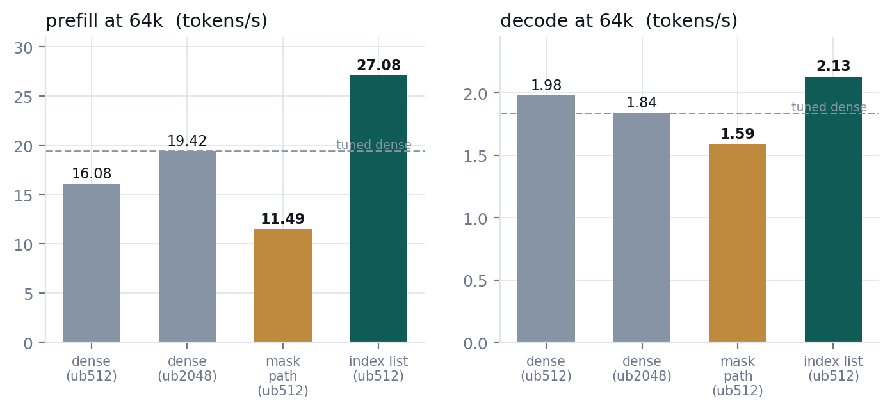

# MiniMax-M3 sparse attention: `--msa-gather`

MiniMax-M3's sparse attention (MSA) scores every cached token against four index heads, max-pools
those scores into blocks of 128, and attends only the top 16 blocks per index head. The answer to
"which cells does this query attend" is therefore **16 block ids** — about 64 bytes.

This branch stops turning that answer into a mask. It also fixes a correctness bug that affects the
previous `minimax-msa` branch.

---

## Correctness fix: the local block was selected from a stale `kv_head`

**This affects the earlier `minimax-msa` branch (`891a963c`) and anyone running `--msa` from it.**

The reference implementation force-includes the query's own block in the top-k selection
(`block_scores.scatter_(q_block, +inf)`). The block id is built with

```c
ggml_arange(ctx0, (float) kv_head, (float) (kv_head + n_tokens), 1.0f);
```

`ggml_arange` stores `start` and `stop` in `op_params` when the **graph is built**, and the CPU
kernel reads them back at execution. That is fine as long as the graph is rebuilt whenever
`kv_head` moves — but `can_reuse_graph()` keys on `kv_self.n`, not on `kv_head`, and with
flash-attention the KV cache pads to 256. So one graph serves up to 256 decode steps while
`kv_head` advances through them, and `update_cache_copies()` re-points the indexer-key cache write
but not this arange.

`B_k` is 128. Inside a single 256-step reuse window the true local block therefore advances twice
while the baked one never moves: **the query's own block is force-included at the wrong index for
roughly half of all decoded tokens.** Graph reuse is on by default.

### How it was measured

Same model, same 16k prompt, greedy, `--temp 0`, fixed seed, 400 generated tokens, comparing
`-gr` (default) against `-no-gr`:

| arm | before the fix | after |
|---|---|---|
| `--msa --msa-gather` | **outputs diverge**, first difference near token 150 | identical |
| `--msa` (mask path) | identical in this sample | identical |
| dense | identical | identical |

Dense being clean rules out a general graph-reuse fault. The mask path not diverging in one sample
is weak evidence of anything — the divergence is a low-probability event — and the same stale
arange is in that path, so it should be assumed affected.

A first attempt to test this reported no difference and was wrong: it ran at `ctx 8192` with a
short prompt, where roughly four KV blocks are non-empty against a 16-block budget, so every block
is selected regardless and the force-include cannot matter. The table above uses a prompt long
enough that 125 blocks contend for 16 slots.

### The fix

Register the arange at build time and re-point it in `update_cache_copies()`, mirroring the `kr_l`
cache-copy fixup that sits a few lines above it in the same function and exists for exactly this
failure mode on the indexer-key write:

```c
((float *) msa_local_arange->op_params)[0] = (float) kv_self.head;
((float *) msa_local_arange->op_params)[1] = (float) (kv_self.head + msa_local_arange->ne[0]);
```

Verified on a matched pair — the configuration that diverged before is byte-identical after — and
on a second, independent prompt. Note that varying `--seed` does **not** vary this test: `--temp 0`
is greedy, so the seed is never read.

---

## What the code did before

Per sparse layer, per ubatch, the selection was expanded into an additive mask as wide as the whole
KV cache:

```
top-k block ids  ->  repeat to block size  ->  cont  ->  add causal floor
                 ->  permute  ->  pad  ->  cast to F16   =  {n_kv, n_tokens, idx_heads}
```

Then flash-attention consumed that mask and discarded ~97% of it.

Two costs follow. The mask is most of the compute buffer, and it grows with context: the measured law
was `0.262268 x n_kv + 70 MiB` at ubatch 512, or **34,446 MiB at 128k**, against 403 MiB for dense
at 16k. And `ggml_flash_attn_ext` requires `mask->ne[1] >= GGML_PAD(n_tokens, 16)`, so at
decode a **single token's mask is padded to 16 rows and cast** — per sparse layer, to carry one real
row.

## What it does now

ik's flash-attention kernel already accepts a sparse cell list: put an I32 tensor on the node's
`src[5]` and `iqk_flash_attn_noalibi` gathers K, V and the mask itself, per query row
(`ggml/src/iqk/iqk_flash_attn.cpp:180`). GLM-DSA drives the same mechanism from
`build_deepseek2.cpp`. MSA could not use it before, because that path requires a single KV head and
MSA's mask carried four planes — the per-GQA-group split in the parent commit is what made the shape
legal.

So the only missing piece was the list itself:

```
sorted (I32 block ids, already computed)      first topk_blk rows = the selection
ggml_mask_to_index(all-zero mask)             -> [0, n_kv) as I32, reshaped {B_k, n_blocks}
ggml_get_rows_ext(table, ids, same_type)      -> the cell ids for the selected blocks
                                              -> attached to fa->src[5]
```

ggml has no integer arithmetic and `ggml_cast` cannot produce I32 (`ggml_compute_forward_dup` handles
F32/F16/BF16 sources only), so the zero-mask trick is the one construction the tree supports today.

With the list in hand, **no sparse mask is built at all**. The kernel reads a mask only at the
selected positions, and the causal floor it needs is already in `KQ_mask`, which the graph builds once
and every sparse layer shares.

---

## Results

MiniMax-M3 Q4_K_M, CPU-only, dual Xeon Platinum 8260, 376 GB DDR4, `-t 48`, GPUs hidden with
`CUDA_VISIBLE_DEVICES=""` (`-ngl 0` alone does **not** stop batch-GEMM offload). Each arm is the same
binary; only the flag differs. Dense is measured at **its own best ubatch (2048)** and MSA at its
best (512) — see the caveat below, it matters.

**Every number here is a single run, and the measured run-to-run spread on this machine is ±1.1%**
(three repeats of one identical configuration gave 51.22 / 50.72 / 50.10 t/s). A fourth repeat taken
immediately after a change of regime came in 18% low, so first-run-after-a-change is discarded.
Read the 64k ratios, which are 39% and 16%, as real; read anything within a couple of percent as no
difference.



| 64k, npp 65536 / ntg 64 | `-ub` | prefill t/s | decode t/s | compute buffer |
|---|---:|---:|---:|---:|
| dense, tuned | 2048 | 19.42 | 1.84 | 1,611 MiB |
| `--msa` (mask path) | 512 | 11.49 | 1.59 | 1,602 MiB |
| `--msa --msa-gather` | 512 | **27.08** | **2.13** | **1,350 MiB** |
| vs tuned dense | | **1.39x** | **1.16x** | |

`-ub 2048` moves the gather to 27.44 / 2.16 (1.41x / 1.17x) for a 5,359 MiB compute buffer — +1.3%
prefill for 4x the buffer, so `-ub 512` is the better operating point and is what the table quotes.

The row that matters most is the middle one: **the mask path is slower than dense at 64k prefill**
(11.49 against 19.42). Selecting blocks and then materialising a mask costs more than the sparsity
saves. Against the path it replaces, the gather is **2.39x prefill and 1.36x decode** — that, not
the comparison with dense, is what this change is for.

### What this actually buys: decode that barely cares about context length

| n_kv | dense decode t/s | gather decode t/s | dense prefill | gather prefill |
|---:|---:|---:|---:|---:|
| 2,240 | 4.15 | **2.77** | 80.33 | 81.26 |
| 4,288 | 4.04 | **2.75** | 74.06 | 69.19 |
| 8,384 | 3.91 | **2.74** | 63.88 | 59.47 |
| 16,576 | 3.30 | **2.60** | 49.34 | 50.45 |
| 65,536 | 1.84 | **2.16** | 19.42 | 27.08 |

Read the decode columns down. The gather goes 2.77 -> 2.16, a **22%** fall across a 29x context
range. Dense goes 4.15 -> 1.84, a **56%** fall. That is the property worth having, and it is not
what a single ratio conveys: the gather pays a roughly constant ~120 ms/token and in exchange
decode stops scaling with `n_kv`. The ratio only turns favourable once dense has degraded past that
fixed cost, which on this model and machine happens somewhere past 16k.

Prefill has its own crossover and the gather is **behind in the middle of the range**: about 7%
slower at 4k-8k, level at 2k and 16k, ahead only at 64k. If your contexts live between 4k and 16k
this branch has nothing to offer you.

### The advantage is a long-context advantage


At 16k the prefill gain is 1.01x — that is inside the ±1.1% noise floor, so the honest statement is
that there is **no measurable prefill difference at 16k**. Decode is **0.81x**, which is well
outside it: at that depth the feature is a real net loss on decode. The gathered attention is flat in `n_kv` while dense attention is not, so the advantage
only appears with depth; the crossover sits between 16k and 64k.

**About "dense, tuned", and a way this table flatters the branch.** A wider ubatch amortises weight
streaming across more query rows. Measured on this file, dense gains **+2.6% prefill at 16k**
(48.71 -> 49.99) and **+20.8% at 64k** (16.08 -> 19.42) from `-ub 2048`.

But dense's decode moves the other way: at 64k it is **1.98 t/s at `-ub 512` and 1.84 at `-ub
2048`**, so the `-ub 2048` row quoted above as "dense, tuned" is dense at a setting that is good for
its prefill and **bad for its decode**. Against dense at its own best *decode* setting the decode
ratio is **1.08x, not 1.16x**. Both comparisons are below, because neither alone is honest:

| gather `-ub 512` (27.08 / 2.13) vs | prefill | decode |
|---|---:|---:|
| dense at its best prefill (`-ub 2048`) | 1.39x | 1.16x |
| dense at its best decode (`-ub 512`) | 1.68x | **1.08x** |

The prefill advantage is larger than the headline and the decode advantage is smaller. If you tune
dense for the metric you care about, the decode win is about 8%.

### Compute buffer


1,350 MiB at 64k, where the mask path's own measured law predicts 17,258 MiB. It still grows with
`n_kv` — but so does dense, which is 403 MiB at 16k and 1,611 MiB at 64k, so at equal context the
gather's buffer is **smaller than dense's**, not larger. (A 128k point of 2,635 MiB was taken
earlier against the same law's 34,446 MiB, but not re-measured in this configuration, so the chart
stops at 64k.)

---

## Quality

Sparse attention changes which cells are attended, so this needs a metric that survives an argmax
flip; greedy text does not.


The measurement that matters is **decode-only**. `llama-perplexity` evaluates in batches, so its graph
is a prefill graph and it never exercises a decode gather at all. Forcing `-ub 1` makes every
evaluation a single-token decode graph:

| decode arm, ctx 8192, `-ub 1`, 1 chunk vs a dense reference | mean KLD | same top-1 |
|---|---:|---:|
| `--msa` (mask path) | 0.014548 ± 0.000546 | 96.020% |
| `--msa --msa-gather` | **0.014529 ± 0.000536** | **96.215%** |

0.02 sigma apart. For context, an earlier construction that derived the same list by scanning the
sparse mask for values exactly zero scored **0.037960 ± 0.002456** — nine sigma worse, and invisible
to both greedy text and ordinary batched perplexity.

---

## What this does not do

- **No help on hybrid GPU.** With 8 of 61 layers on four P100s, dense reaches 53.37 t/s prefill and
  every MSA arm lands between 30 and 34. MSA nearly doubles backend graph splits (1410 vs 774) and
  each split is a synchronisation. Use dense there.
- **It is a net loss below about 16k.** Prefill is ~7% slower at 4k-8k, and decode is 0.81x at 16k.
  The fixed per-token cost dominates until dense has degraded past it.
- **Decode gather is off inside this flag's fast path only where it is safe**; the largest remaining
  CPU lever is untouched — the prefill kernel is called once per query token, making every sparse
  GEMM 16 wide, roughly 1.31x under its arithmetic roofline.

## Using it

```
llama-cli -m <MiniMax-M3 GGUF> --msa --msa-gather -c 65536 -t 48 -fa 1 ...
```

`--msa-gather` is off by default. It falls back to the mask path for tensor-parallel attention,
`-fa 0`, an `n_kv` that is not a multiple of the block size, and any model whose head counts do not
divide.

GGUFs converted by mainline llama.cpp are read directly on this branch. Mainline spells the indexer
hyper-parameters `attention.indexer.*` and its tensors `blk.N.indexer.{q,k}_proj`; our converter wrote
`attention.sparse_*` and `blk.N.index_{q,k}`. Both spellings are accepted now, so a published
conversion runs MSA here instead of silently falling back to dense.
